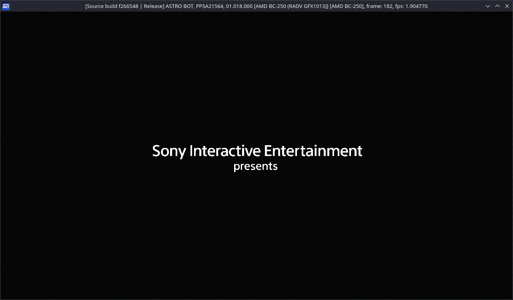
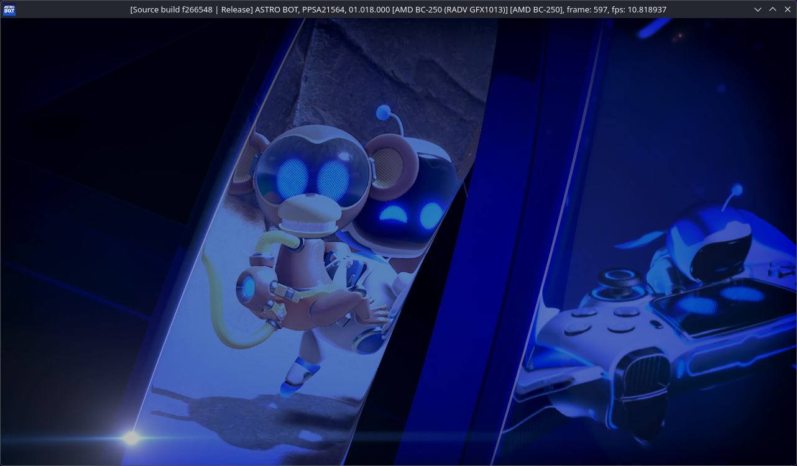
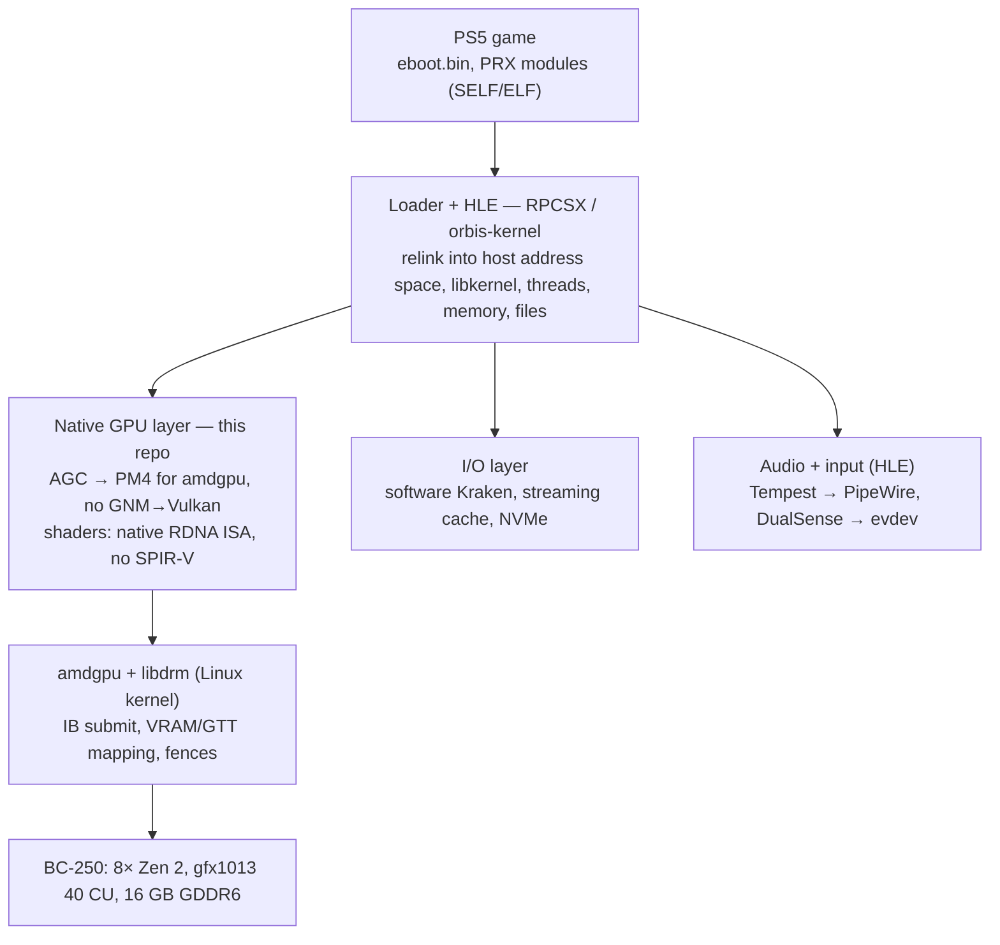

# BC5

**BC-250 + PS5. A native PS5 GPU path for the AMD BC-250 (Cyan Skillfish, gfx1013).**
User-space backend that feeds PS5 AGC command streams and native RDNA ISA shaders to `amdgpu` on Linux, without GNM→Vulkan translation or shader recompilation.

> Status: research / pre-alpha. Phase 0a tooling (`bc5-mount`, read-only access to `.ffpfsc` containers) works. Since 2026-10-01 the direct GPU path renders a game's first screens on the BC-250 — its own command buffers and shader binaries, filtered but not translated — at about twelve frames per second, through its whole intro video (935 frames without a failed submission); and into the first frames of its own 3D scene; nothing is playable, and the run currently ends on the graphics driver's memory accounting (the game's memory no longer fits the GTT domain a submission may name, HANDOFF F44). This repository is a plan, a set of experiments and their results. No game files, firmware or SDK material are or will ever be hosted here.



*2026-10-01, experiment 0016, run 79: the first recognisable frame. The maintainer's own copy of ASTRO BOT in the track-B host (KytyPlus with the game's own `libSceAgc`), its PM4 command buffers submitted to `amdgpu` on the BC-250's GFX ring and its RDNA shader binaries executed as they are. The window title names the GPU; these screenshots are the only game output in this repository.*



*The same day, experiment 0017, run 90: the game's first intro video, its frames uploaded by the command processor and composited by the game's passes, 11 frames per second.*

---

## What this is

The BC-250 is a repurposed mining board built around the same APU family as the PlayStation 5 (AMD Oberon / Cyan Skillfish): Zen 2 CPU, gfx1013 GPU, 16 GB unified GDDR6. Every existing PS5 emulator or compatibility layer targets generic PCs and therefore has to translate the GPU side: AGC/PM4 command buffers become Vulkan calls and RDNA shader binaries are recompiled to SPIR-V.

On the BC-250 that translation is unnecessary. CPU code already runs natively (x86-64), and the GPU is the same silicon target as the console. This project builds the missing piece: a thin layer between an existing PS5 user-space runtime (RPCSX first) and the Linux `amdgpu` kernel driver that submits the game's command stream and shaders as-is.

## What this is not

- **Not a firmware boot.** The PS5 boot chain (PSP with Sony keys, Sony ABL/SMU, hypervisor) will not run on a BC-250, and the board lacks the console's southbridge, SSD/Kraken decompressor and Tempest audio. Everything here is user-space on top of a normal Linux kernel.
- **Not a new emulator.** The loader, HLE libraries, audio and input come from existing projects. This repo contributes a GPU backend and the tooling to validate it.
- **Not a piracy tool.** See [Legal](#legal).

## Why the BC-250

| Component | PS5 | BC-250 (unlocked) | Relevance |
| --- | --- | --- | --- |
| CPU | 8× Zen 2, ~7 for games, up to 3.5 GHz, 128-bit FPU | 8C/16T after core unlock, up to ~4 GHz | Identical ISA; game code runs natively |
| GPU | 36 CU gfx1013, 2.23 GHz | 40 CU after CU unlock, ~2.2 GHz | Same ISA and hardware blocks; driver is `amdgpu` + Mesa, not Sony's |
| Memory | 16 GB GDDR6, 256-bit, unified | 16 GB GDDR6, 256-bit, unified | Identical; no bandwidth throttling needed |
| Storage | Custom SSD ~5.5 GB/s + hardware Kraken | SATA/NVMe over M.2, no decompressor | Largest gap; needs a software I/O layer |
| Boot / security | Sony PSP keys, Sony ABL/SMU, hypervisor | Generic AMD PSP (1022:143e), different ABL/SMU | Sony firmware cannot boot; we stay in user space |
| Audio / input | Tempest 3D, DualSense | Realtek/USB, any pad | HLE, as in RPCSX |

Key facts established so far (September 2026):

- **Both the PS5 GPU and the BC-250 are `gfx1013`** (GFX10.1 with ray-tracing instructions), not gfx10.3. A native-homebrew Vulkan project on a real PS5 compiles through the ACO GFX1013 backend, and Mesa/RADV identifies the BC-250 as the same target. There is no ISA gap to close; the only rule is to avoid `gfx10-3-insts`.
- **AGC command buffers are standard PM4 type-3 packets.** Public emulator code frames them as generic PM4 and handles `SET_CONTEXT_REG`, `SET_SH_REG`, `RELEASE_MEM`, `WRITE_DATA`, `COPY_DATA`, `DMA_DATA`, `DUMP_CONST_RAM`, `DISPATCH_INDIRECT` and friends. Sony-specific register usage is expected in draw/CB/DB packets.
- **`amdgpu` does not parse GFX indirect buffers.** Submitting raw PM4 with shader binaries from user space is the normal path (this is what RADV does); privileged registers are protected by CP firmware. libdrm's `tests/amdgpu` contains dispatch and draw tests for gfx10 with embedded shader binaries: that is the starting point for phases 2 and 3.
- **BC-250 caveats:** RADV disables the gfx1013 compute queue (use the GFX ring), and a GPU reset after a bad submission can take the whole machine down.

## Architecture



Only the highlighted layer is new. The game and loader come from RPCSX; this backend replaces its Vulkan backend wherever AGC can be handed to `amdgpu` untranslated; I/O and audio stay in HLE.

### Backend modes

1. **Validation** – decode the AGC stream, log every PM4 packet and register write, submit nothing. Used to learn the format on real captures.
2. **Hybrid** – native shader binaries (ISA loaded into VRAM), commands still through Vulkan/RADV. Cautious path.
3. **Direct** – own libdrm_amdgpu client: BO allocation, 1:1 GPU VA mapping of the game's address space, IB submission with rewritten packets. Full gain, highest risk (GPU hangs, no validation).

### CU partitioning: 36 for the runtime, 4 for the desktop

The runtime is masked to 36 CUs so frame timing matches the console, while the remaining 4 CUs stay free for the compositor and desktop. CU masks are SH registers written in our own IB: `COMPUTE_STATIC_THREAD_MGMT_SE0-3` for compute, `CU_EN` fields in `SPI_SHADER_PGM_RSRC3_PS/VS/GS/HS` for graphics stages. Caveats: the desktop (via RADV) is not confined to the spare 4 CUs, it just usually finds them free; which 4 of 40 CUs are fused off differs per console, so games cannot depend on it; if a game writes its own CU masks, ours must be ANDed with them, not written over them.

Measured on the BC-250 (experiment 0019): the compute mask registers carry 20 live bits per shader engine, one per CU (bits 20–31 do nothing), so the board's 40 CUs are bits 0–19 of `COMPUTE_STATIC_THREAD_MGMT_SE0/SE1` and a 36-CU compute mask is 0x0003ffff; throughput is linear in the bit count. The graphics stages' `CU_EN` is a 16-bit field; which CUs it selects is still to be measured.

## Roadmap

Gated phases; each ends with an experiment whose result decides whether the next one makes sense. No dates.

| Phase | Work | Gate |
| --- | --- | --- |
| 0a Input | `bc5-mount`: a FUSE mount for `.ffpfsc` containers (PFS v2 → PFSC decompression → exFAT), exposing a game dump as a plain `app0` directory so every later phase works on one canonical input; read-only, no re-packing | A container mounts and its file tree and checksums match the unpacked dump |
| 0b Foundation | Build RPCSX on the BC-250 (distrobox/Fedora), boot PS5 VSH and safe mode through the stock Vulkan backend, record baseline FPS and RADV logs | VSH boots |
| 1b Track B | KytyPlus (GPL-2.0) as an HLE host that LLE-loads the game's own `fakelib/libSceAgc.sprx` and `libSceAgcDriver.sprx`; implement the kernel imports Sony's driver needs and capture its `/dev/gc` submissions — Sony's command stream without a firmware dump | A DCB built by Sony's code is captured and decodes |
| 1 Validation | AGC stream parser (references: Kyty `guest_gpu`, RPCSX, astraea), tapped into the host, logging every packet and register | A full frame decodes with zero unknown opcodes |
| 2 Native shaders | Load a compute shader binary from a capture into VRAM and run it through `amdgpu` (pattern: libdrm `shader_code_gfx10.h`, IGT `amdgpu_dispatch_shader`); compare with the same shader through Kyty's recompiler | Bit-identical results |
| 3 IB submit | Own libdrm_amdgpu client: the game's memory mapped 1:1 (userptr), its command buffers filtered (not rewritten) and submitted to the GFX ring; 36/40 CU switch and measurement. **In progress (experiment 0016):** the console's state preamble, its register-shadow loads, waits and atomics and, since 2026-09-30, whole frames run on the BC-250. On 2026-10-01 the game's own frames reached the screen: ASTRO BOT's command buffers and shader binaries, filtered but not translated, rendered its first screens on the BC-250 from the track-B host (loading-time black, then the publisher's "presents" card fading in), a frame every 0.083 s by the end of the day (direct memory handed to the GPU as dma-bufs of the host's memfd, ADR 0006), runs of 280–510 consecutive frames without a failed submission. Getting there took an emulation of the console CP's context-state stack, the queues' label hand-overs and event wake-ups (HANDOFF F34–F37). The CU-mask measurement is recorded (F39). The stop after 510 frames was the host's doorbell-queue protocol (F42: read pointer location, then ring wrap), fixed: the intro now runs to its end (F43). The system JSON library the game called next is provided by the host (experiment 0020), and the game draws the first frames of its own scene until its memory outgrows the driver's GTT domain (F44). The CU mask is measured (experiment 0019: 20 live bits per shader engine, a 36-CU compute mask is 0x0003ffff). Still open: the graphics stages' 16-bit CU mask, presentation without readback. | Image on screen, no GPU hang |
| 4 Integration | Backend as a build option in RPCSX (or a `rpcsx-bc250` fork); first 2D title from Kyty's compatibility list | Game menu through the native path |

Phase 0a comes first on purpose: one canonical input format keeps every later experiment reproducible and lets dumps made on the console (which come out as FFPFSC) be used as-is. Phase 3 is the first point where this project contributes something no other project has; phases 0-2 are preparation and measurement. First concrete experiment: build `amdgpu_test` from libdrm and run its dispatch/draw suite on the BC-250, on the GFX ring.

## Open questions

- [x] 1:1 memory mapping. **Yes** (experiment 0014, HANDOFF F23): a userptr BO mapped at GPU VA = CPU pointer works with zero copies. Since experiment 0017 the game's direct memory goes one better: ranges of the host's memfd are imported as dma-bufs and mapped at the guest's addresses, without the per-submission page walk userptr costs (ADR 0006, F40).
- [x] How RPCSX handles AGC today. **Answered** (HANDOFF F12, F19): RPCSX has no AGC parser; PS5 submits enter through `/dev/gc` ioctls carrying a `CONTEXT_CONTROL` packet, a state-preamble IB and the frame DCB. Track B therefore runs the game's own `libSceAgc` on top of an emulated `/dev/gc` instead of tapping RPCSX.
- [x] Whether PS5 titles write CU masks themselves. **Yes** (F21, F39): every compute dispatch writes `COMPUTE_STATIC_THREAD_MGMT_SE0..3` = 0xffffffff and the graphics stages load `RSRC3.CU_EN` = 0xffff from register tables; BC5's mask is ANDed into both. What the bits mean on the BC-250 is measured for compute (experiment 0019: bits 0–19 per shader engine, one per CU).
- [ ] Which draw/CB/DB register usage is Sony-specific beyond public PM4. **Partly**: so far one unresolved SH register and one APU-only opcode (F21), the 64-bit `WAIT_REG_MEM` and index-load opcodes (experiment 0016), and — more important than any register — command-processor behaviour the console's system provides and `amdgpu` does not: `CLEAR_STATE` push/pop (F35), waiting for CP DMA (F41), register shadowing. The list keeps growing with every new part of the game.
- [ ] Which CUs the graphics stages' 16-bit `CU_EN` selects on a 20-CU shader engine (experiment 0019's open half).
- [ ] Storage: how much of the SSD/Kraken dependency a software prefetch/cache layer can hide. Deferred to after phase 4.

## Tooling: `bc5-mount`

`tools/bc5-mount` reads `.ffpfsc` containers (PFS v2 → PFSC → exFAT; layout in [`docs/formats/ffpfsc.md`](docs/formats/ffpfsc.md)) and exposes the game's `app0` tree. Rust, no unsafe code, every parser rejects malformed input instead of panicking.

```bash
cd tools && cargo build --release
bc5-mount inspect  GAME.ffpfsc                 # superblock, PFSC stats, file count, title from param.json
bc5-mount ls -r    GAME.ffpfsc [dir]           # list the tree
bc5-mount cat      GAME.ffpfsc sce_sys/param.json
bc5-mount verify   GAME.ffpfsc > hashes.txt    # sha256  size  path, one line per file
bc5-mount mount    GAME.ffpfsc /mnt/app0       # read-only FUSE mount (Linux, feature `fuse`, default on)
```

Tests never touch a real dump: `bc5-fixture` builds deterministic synthetic containers (`bc5-fixture list|build|tree|hashes`), and the test suite round-trips every preset through the full stack. `cargo test` runs everywhere; `cargo test -- --ignored` adds a 1 GiB sparse case.

`tools/bc5-agc` (phase 1) decodes PM4 command-stream captures: `bc5-agc dump <capture>` prints every packet and register write by name (GFX10 names from Mesa's register tables, vendored under `tools/bc5-agc/regdb/` with their MIT licence), `bc5-agc report <captures…>` counts opcodes, unresolved register offsets and CU-mask writes. How RPCSX hands AGC to its PM4 interpreter is documented in [`docs/formats/agc.md`](docs/formats/agc.md).

## Requirements

- AMD BC-250 with the community core and CU unlocks applied (8C/16T, 40 CU) and the dynamic VRAM split in BIOS.
- Linux with a recent kernel and Mesa/RADV that recognises gfx1013 (Bazzite or Fedora work; other distributions untested). Check whether your kernel carries the BC-250 PSP/CCP patch series.
- A container or distribution with a C++ toolchain, libdrm_amdgpu headers, CMake and the RPCSX build dependencies.
- Your own PS5 and your own game dumps, decrypted on your own hardware, as an unpacked `app0` folder or an `.ffpfsc` container. See [Legal](#legal).

## Related projects

| Project | What it is | Why it matters here |
| --- | --- | --- |
| [RPCSX](https://github.com/RPCSX/rpcsx) | PS4/PS5 emulator for Linux, loads real system software (RPCS3 model) | Host runtime this backend targets |
| [KytyPS5](https://github.com/KytyPS5/KytyPS5) | PS5 emulator, fastest-moving; `guest_gpu` + RDNA→SPIR-V recompiler | Reference for AGC decoding and for cross-checking shader results |
| [SharpEmu](https://github.com/sharpemu/sharpemu) | PS5 emulator in C#, accuracy-first | Reference for the loader and file layout |
| [AnyPS5](https://github.com/boykopovar/AnyPS5) | Relinker + library reimplementation (Wine model) | AGC recorder driver with a documented packet set |
| [prosper](https://github.com/mattias800/prosper) | User-space PS5→PC layer, AGC→Vulkan | Second description of the AGC format |
| [ps5-vulkan](https://github.com/mpereiraesaa/ps5-vulkan) | Vulkan-style API for native PS5 homebrew, gfx1013 | Closest existing code to native submission on this silicon |
| [OpenProspero/AGC](https://github.com/OpenProspero/AGC) | Clean-room PS5 GPU driver, PM4 snapshots simulated on CPU | Documents which packets are public and which are not |
| [astraea](https://github.com/astraea-emu/astraea) | PS5 frontend framing AGC DCB as PM4, lowering `SET_SH_REG` to IR | Packet-framing reference |
| [PS5 PKG Tool](https://github.com/pearlxcore/PS5PKGTool) | Managed exFAT, PFSC and PFS implementations; converts between dump folders, exFAT, FFPKG and FFPFSC | Reference for `bc5-mount` (phase 0a) |
| libdrm `tests/amdgpu` | Dispatch/draw tests for gfx10 with embedded shader binaries | Starting code for phases 2-3 |
| [AMD-GPU-Debugger](https://github.com/orgito1015/AMD-GPU-Debugger) | Raw PM4 submission via libdrm, ACO null-winsys compilation | Worked example of the direct path |

BC-250 documentation: [elektricm/amd-bc250-docs](https://elektricm.github.io/amd-bc250-docs/), [bc-250.com wiki](https://bc-250.com/wiki), [Phoronix: RADV for Cyan Skillfish](https://www.phoronix.com/news/AMD-RADV-PS5-BC-250), [akandr/bc250-rocm](https://github.com/akandr/bc250-rocm).

## Contributing

Talk before coding: open an issue describing the experiment you want to run and what result would settle it. Each phase has its own directory with notes, scripts and raw results (logs, captures, FPS), so the next person starts from facts rather than memory. Register names, packet layouts and findings must cite a public source or an experiment in this repo.

## Legal

This is an interoperability research project and takes an explicit stance against piracy.

- **No Sony material is hosted or accepted here**: no firmware, system modules, keys, SDK files, game dumps or decrypted binaries, and no links to them. Pull requests or issues containing such material will be removed.
- **Bring your own hardware.** Testing requires a PS5 you own and game copies you own, dumped on your own console. How you obtain and handle that material is your responsibility and subject to the laws of your country.
- **No warranty.** Raw GPU submission can hang or reset the machine and, in principle, damage hardware. You use this software at your own risk.
- The leaked PS5 boot ROM keys are neither needed nor welcome in this project.

## License

GPL-2.0, matching RPCSX, so that the backend can be merged upstream without relicensing. Files that originate elsewhere keep their own licence and say so in their header.
