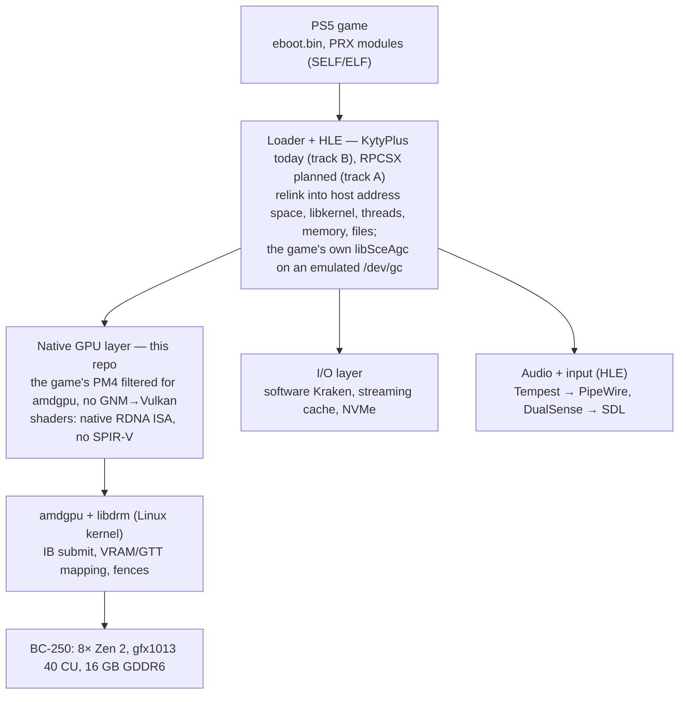

# BC5

**BC-250 + PS5. A native PS5 GPU path for the AMD BC-250 (Cyan Skillfish, gfx1013).**
User-space backend that feeds PS5 AGC command streams and native RDNA ISA shaders to `amdgpu` on Linux, without GNM→Vulkan translation or shader recompilation.

> Status: research / alpha. **ASTRO BOT — the maintainer's own copy — is fully playable on the BC-250** in the maintainer's judgement (2026-10-08): every level they have played, from the intro through the first and second levels and beyond, with the game's own command buffers and shader binaries submitted through the direct GPU path, filtered but not translated (HANDOFF F43–F85). The first level runs at 47–55 frames per second and the second at 40–51 (the title is built for 60); a level loads in about 18 s, much of it under the opening cutscene; the DualSense's buttons, sticks, motion, adaptive triggers and haptics reach the game; the save survives a restart; any control can be rebound from a menu in the game window. The longest unattended run is 30 minutes and 1.3 million submissions without a failure. **A second title, the maintainer's own copy installed from a PS5 package (`.pkg`), loads and renders 3D at 16–24 fps** through the same path, read straight from the package by `bc5-mount`; since its compute queues' indirect dispatches run (F91) it gets through 300–600 s runs in two of three (F86–F91). This repository is a plan, a set of experiments and their results. No game files, firmware or SDK material are or will ever be hosted here.


*2026-10-01, experiment 0016, run 79: the first recognisable frame. The maintainer's own copy of ASTRO BOT in the track-B host (KytyPlus with the game's own `libSceAgc`), its PM4 command buffers submitted to `amdgpu` on the BC-250's GFX ring and its RDNA shader binaries executed as they are. The window title names the GPU; these screenshots are the only game output in this repository.*


*The same day, experiment 0017, run 90: the game's first intro video, its frames uploaded by the command processor and composited by the game's passes, 11 frames per second.*

---

## Where it stands

All on the BC-250 dev box, with the track-B host (KytyPlus running the game's own `libSceAgc`) and this repository's backend; every number has its experiment under `experiments/` and its finding in [`docs/HANDOFF.md`](docs/HANDOFF.md).

| What | Result | Record |
| --- | --- | --- |
| First image through the direct path (gate G3) | 2026-10-01, the game's opening card | experiment 0016, F37 |
| Whole intro video | 935 frames without a failed submission | experiment 0018, F43 |
| Title screen, controller input | real-time scene; a button press starts the game | experiment 0020, F45–F46 |
| First level and opening cutscene | load and play; the game keeps 7.9 GiB visible to the GPU | experiments 0021–0022, F47–F48 |
| First level, gameplay | the character walks, the pause screen opens; DualSense buttons, sticks and motion work (the maintainer at the controller); 47–55 fps with jobs in flight, through the level to the galaxy map and the flight to the next level | experiment 0022 runs 104 and 106, experiment 0024 run 115, F52–F53, F59 |
| Second level and beyond | loads and plays under the player's control at 40–51 fps, water and geysers included; the fluid simulation runs a frame behind (a stopgap for a handshake the single ring cannot serve, F64); the maintainer has played further levels, the frog-glove level included, and calls the game fully playable | experiments 0024–0026, F59, F64, F78, F85 |
| Controller and save | buttons, sticks, triggers, shaking and tilting (the orientation is derived from the gyroscope and accelerometer), hot-plug; any control can be bound to a key, a mouse button or another pad input, and a pad input disabled, from a configuration file (`input.example.cfg`) or from the F2 settings menu in the game window (confirmed by the maintainer); the game's save is kept in a file and picked up at the next start — both confirmed by the maintainer. Haptics: the game's vibration audio streams go to the DualSense's own four-channel audio device (F69); **haptics work** — the game's vibration streams reach the DualSense's actuators through its own USB audio device (F69, F79, F80) and the adaptive triggers answer the game (F78); the maintainer, 2026-10-08: "works perfectly", the shakes, hits and effects felt as they should | F52–F53, F59–F61, F78–F80 |
| Frame rate | synchronously: title screen 47 fps, cutscene 41 fps — from 8 and 6 fps the same day, all of it host overhead removed. With submissions no longer waited for one by one: title and loading 54–60 fps, cutscene 50–53 fps, gameplay 47–55 fps | experiments 0022–0024, F49–F59 |
| Longest runs | 30 minutes with jobs in flight, 1,332,438 submissions, none failed; 12 minutes synchronously, 258,551 submissions, three recovered page faults | runs 116, 103 |
| GPU time in a frame | first level 12.9 ms, second level 18.6 ms (synchronous); with jobs in flight the second level is a 21–24 ms frame of which the GPU is busy 17–18, the game's own thread 12, the host's pass over the main buffer 4 | experiments 0023–0026, F65 |
| Level load | about 18 s for the first level, from 240 s: the host listed a directory for every file the game looks for and does not find (experiment 0022), the mount took 8 ms to say a file does not exist (experiment 0029), and one mount thread served every read in turn (experiments 0032–0033); "loading runs very smoothly" (the maintainer) | experiments 0022, 0029, 0032–0033, F84 |
| Compute CU mask | 20 live bits per shader engine, one CU per bit; throughput linear in the bit count | experiment 0019, F39 |
| Second title: from its PS5 package | the whole 101.8 GB package reads and mounts (`bc5-mount`, 288 files, every one decoded in 196 s); the title starts from the mount with the system modules of another of the maintainer's own dumps | experiments 0031, 0034, 0036, F82, F86, F88 |
| Second title: AMM/AMPR | the title maps memory through AMM and streams files through APR command buffers; the host's AMM window, page protections, waits, per-priority queues and completion events were made to work | experiments 0035–0037, F87–F89 |
| Second title: to 3D | four stops on the way, none in the GPU path proper: the AMM window over the title's heaps, two Kraken chunk forms in the package reader, a bound in the ATRAC9 decoder, heaps the direct path did not import; then 6.7 fps | experiment 0036, F88 |
| Second title: speed | 24 fps in its first 3D scene (frame 147 → 39 ms): the host's per-submission bookkeeping over 11,500 memory views and 12,000 GPU mappings, not the title or the GPU (11 ms) | experiment 0037, F89 |
| Second title: compute work | its compute IBs' indirect dispatches (compute-queue form) now run on the GFX ring, rebuilt with SET_BASE and `PFP_SYNC_ME`; one program that hangs the single ring is skipped; 600 s clean at 16 fps (the GPU does the work it used to skip), two runs of three past the point that used to fault | experiments 0038–0039, F90–F91 |

**Haptics and adaptive triggers work.** The DualSense's actuators get the game's vibration streams, the triggers report their state to the game (the frog gloves fire), and the maintainer confirmed the feel in the game on 2026-10-08: shakes, hits and effects as on the console (F78–F80). Needed on the host: the controller's PipeWire sink at full volume (`pad-volume.sh`).

What is not there yet: full speed (the game is built for 60 fps; in the second level the GPU is busy 75–80 % of a 21–24 ms frame and the game's own thread needs 12 ms of it). The CPU is not the limit: during the maintainer's play the busiest threads sit at half a core (F81), and the level load waits on the game's own loaders, not on the files (F83–F84). A second title, from a PS5 package, now loads and renders 3D at 16–24 fps and runs its compute queues' indirect dispatches; one run in three still stops on a GPU fault, and one of its compute programs is skipped because it hangs the single ring (F86–F91). What has not been tried: RPCSX as the host (needs system software the maintainer cannot dump at present).

## What this is

The BC-250 is a repurposed mining board built around the same APU family as the PlayStation 5 (AMD Oberon / Cyan Skillfish): Zen 2 CPU, gfx1013 GPU, 16 GB unified GDDR6. Every existing PS5 emulator or compatibility layer targets generic PCs and therefore has to translate the GPU side: AGC/PM4 command buffers become Vulkan calls and RDNA shader binaries are recompiled to SPIR-V.

On the BC-250 that translation is unnecessary. CPU code already runs natively (x86-64), and the GPU is the same silicon target as the console. This project builds the missing piece: a thin layer between an existing PS5 user-space runtime (KytyPlus today, RPCSX once its system software is available) and the Linux `amdgpu` kernel driver that submits the game's command stream and shaders as-is.

## What this is not

- **Not a firmware boot.** The PS5 boot chain (PSP with Sony keys, Sony ABL/SMU, hypervisor) will not run on a BC-250, and the board lacks the console's southbridge, SSD/Kraken decompressor and Tempest audio. Everything here is user-space on top of a normal Linux kernel.
- **Not a new emulator.** The loader, HLE libraries, audio and input come from existing projects. This repo contributes a GPU backend and the tooling to validate it.
- **Not a piracy tool.** See [Legal](#legal).

## Why the BC-250

| Component | PS5 | BC-250 (unlocked) | Relevance |
| --- | --- | --- | --- |
| CPU | 8× Zen 2, ~7 for games, up to 3.5 GHz, 128-bit FPU | 8C/16T after core unlock, up to ~4 GHz | Identical ISA; game code runs natively |
| GPU | 36 CU gfx1013, 2.23 GHz | 40 CU after CU unlock, ~2.2 GHz | Same ISA and hardware blocks; driver is `amdgpu` + Mesa, not Sony's. The runs here have the clock at 1850–2000 MHz |
| Memory | 16 GB GDDR6, 256-bit, unified | 16 GB GDDR6, 256-bit, unified | Identical; no bandwidth throttling needed |
| Storage | Custom SSD ~5.5 GB/s + hardware Kraken | NVMe in an M.2 slot that links at PCIe 2.0 ×2: 0.7–0.8 GB/s measured; no decompressor | A smaller gap than expected so far: the first level asks for a few MiB/s, and what made loading slow was the host (experiment 0022). A package's Kraken blocks are decoded in software by `bc5-mount` (F82, F88) |
| Boot / security | Sony PSP keys, Sony ABL/SMU, hypervisor | Generic AMD PSP (1022:143e), different ABL/SMU | Sony firmware cannot boot; we stay in user space |
| Audio / input | Tempest 3D, DualSense | Realtek/USB audio, a DualSense over USB | HLE in the host runtime; buttons, sticks, motion sensors, the orientation derived from them, adaptive triggers and haptics (an audio stream to the controller's own USB audio device) work in the game (F78–F80) |

Key facts established so far (September–October 2026):

- **Both the PS5 GPU and the BC-250 are `gfx1013`** (GFX10.1 with ray-tracing instructions), not gfx10.3. A native-homebrew Vulkan project on a real PS5 compiles through the ACO GFX1013 backend, and Mesa/RADV identifies the BC-250 as the same target. There is no ISA gap to close; the only rule is to avoid `gfx10-3-insts`.
- **AGC command buffers are standard PM4 type-3 packets.** Public emulator code frames them as generic PM4 and handles `SET_CONTEXT_REG`, `SET_SH_REG`, `RELEASE_MEM`, `WRITE_DATA`, `COPY_DATA`, `DMA_DATA`, `DUMP_CONST_RAM`, `DISPATCH_INDIRECT` and friends. Sony-specific register usage is expected in draw/CB/DB packets.
- **`amdgpu` does not parse GFX indirect buffers.** Submitting raw PM4 with shader binaries from user space is the normal path (this is what RADV does); privileged registers are protected by CP firmware. libdrm's `tests/amdgpu` contains dispatch and draw tests for gfx10 with embedded shader binaries: that is the starting point for phases 2 and 3.
- **BC-250 caveats:** RADV disables the gfx1013 compute queue (use the GFX ring), and a GPU reset after a bad submission can take the whole machine down. Experiment 0016 catalogued the packets that do (HANDOFF, "reset classes"); none has occurred since.
- **The console's command processor does more than `amdgpu`'s.** A game's stream relies on `CLEAR_STATE` pushing and popping the context state, on CP DMA being finished before the next buffer, on labels and events handed over between queues. The backend supplies these by rewriting the stream around them — still the game's packets and shaders, not a translation (F34–F42).
- **Memory is the tight resource, not the GPU.** The game reserves 12.4 GiB of GPU-visible memory; a draw may touch any of it, so all of it that holds data must sit in `amdgpu`'s GTT domain at once, and that domain is half of the RAM unless `ttm.pages_limit` says otherwise (F44, D12). All guest memory reaches the GPU as dma-bufs of the host's own backing files, without copies and without the per-submission page walk of userptr (ADR 0006, experiment 0023).
- **The frame is now mostly the GPU's own time.** The first level went from 6 to about 50 frames per second without a change to what the GPU executes: a minimal journal, merged dma-buf imports, a kept buffer list, no userptr (experiments 0022–0023), and submissions that overlap instead of being waited for one by one (experiment 0024). That last step needed the host to serve a queue the way the console does — in order, each entry as soon as its wait is satisfied — because the game's frame is a handshake of labels between its graphics and compute queues (F58).
- **The untranslated path is gfx1013's alone.** A census of 485 of the game's shader programs (experiment 0025) finds the multiply-add instructions RDNA2 removed in 449 of them and an instruction Navi 10/12/14 lack in 69; no ray tracing. So no GPU you can buy runs this title's shaders as they are except the console's own silicon, which is what the BC-250 carries (F63).
- **A title installed from a PS5 package runs from the package.** `bc5-mount` reads debug packages (plaintext outer PFS, `naps_pkg_layout.dat`, Kraken blocks without Oodle headers) and needed two chunk forms no public decoder handled correctly (F82, F88). The second title then needed what ASTRO BOT never used: AMM, the console's address map manager, and APR, its file-streaming command buffers, both emulated by the host (F87–F89). Its frame rate was decided by the host's bookkeeping, which grows with the number of memory ranges a title maps (F89).
- **Past the GPU, progress is decided by the stand-ins for system libraries.** With no system software to load, every system library the game links against is a stand-in in the host: KytyPlus has most of them, and what it lacked was added here from public symbol names. The two stops after the first level were both there: a JSON getter that answered 0 for an unsigned count, and a save memory that lived only in RAM (F59); the ship that would not tilt was a pad orientation nobody computed (F60).

## Architecture



Only the GPU layer is new. The game and loader come from the host runtime: on track B that is KytyPlus with the patch set in [`backend/kytyplus-patches/`](backend/kytyplus-patches/), which loads the game's own `libSceAgc` and gives it a `/dev/gc` whose submissions go to this backend; on track A it will be RPCSX with the console's system software. The backend takes the place of the host's Vulkan renderer wherever the stream can be handed to `amdgpu` untranslated; I/O and audio stay in HLE, and the host's Vulkan side is left with presenting the finished frame.

### Backend modes

1. **Validation** – decode the AGC stream, log every PM4 packet and register write, submit nothing. Used to learn the format on real captures.
2. **Hybrid** – native shader binaries (ISA loaded into VRAM), commands still through Vulkan/RADV. Cautious path.
3. **Direct** – own libdrm_amdgpu client: BO allocation, 1:1 GPU VA mapping of the game's address space, IB submission with rewritten packets. Full gain, highest risk (GPU hangs, no validation).

Mode 3 is what the results above run on; mode 1 produced the captures it was built from, and mode 2 was skipped.

### CU partitioning: 36 for the runtime, 4 for the desktop

The runtime is masked to 36 CUs so frame timing matches the console, while the remaining 4 CUs stay free for the compositor and desktop. CU masks are SH registers written in our own IB: `COMPUTE_STATIC_THREAD_MGMT_SE0-3` for compute, `CU_EN` fields in `SPI_SHADER_PGM_RSRC3_PS/VS/GS/HS` for graphics stages. Caveats: the desktop (via RADV) is not confined to the spare 4 CUs, it just usually finds them free; which 4 of 40 CUs are fused off differs per console, so games cannot depend on it; if a game writes its own CU masks, ours must be ANDed with them, not written over them.

Measured on the BC-250 (experiment 0019): the compute mask registers carry 20 live bits per shader engine, one per CU (bits 20–31 do nothing), so the board's 40 CUs are bits 0–19 of `COMPUTE_STATIC_THREAD_MGMT_SE0/SE1` and a 36-CU compute mask is 0x0003ffff; throughput is linear in the bit count. The graphics stages' `CU_EN` is a 16-bit field; which CUs it selects is still to be measured. The runs recorded so far use the full mask; the switch (`BC5_DIRECT_CU_MASK`) covers masks the stream sets directly and masks it loads from memory.

## Roadmap

Gated phases; each ends with an experiment whose result decides whether the next one makes sense. No dates.

| Phase | Work | Gate |
| --- | --- | --- |
| 0a Input | `bc5-mount`: a FUSE mount for `.ffpfsc` containers (PFS v2 → PFSC decompression → exFAT), exposing a game dump as a plain `app0` directory so every later phase works on one canonical input; read-only, no re-packing | A container mounts and its file tree and checksums match the unpacked dump |
| 0b Foundation | Build RPCSX on the BC-250 (distrobox/Fedora), boot PS5 VSH and safe mode through the stock Vulkan backend, record baseline FPS and RADV logs | VSH boots |
| 1b Track B | KytyPlus (GPL-2.0) as an HLE host that LLE-loads the game's own `fakelib/libSceAgc.sprx` and `libSceAgcDriver.sprx`; implement the kernel imports Sony's driver needs and capture its `/dev/gc` submissions — Sony's command stream without a firmware dump | A DCB built by Sony's code is captured and decodes |
| 1 Validation | AGC stream parser (references: Kyty `guest_gpu`, RPCSX, astraea), tapped into the host, logging every packet and register | A full frame decodes with zero unknown opcodes |
| 2 Native shaders | Load a compute shader binary from a capture into VRAM and run it through `amdgpu` (pattern: libdrm `shader_code_gfx10.h`, IGT `amdgpu_dispatch_shader`); compare with the same shader through Kyty's recompiler | Bit-identical results |
| 3 IB submit | Own libdrm_amdgpu client: the game's memory mapped 1:1 (dma-bufs of the host's backing files, ADR 0006; userptr at first), its command buffers filtered (not rewritten) and submitted to the GFX ring; 36/40 CU switch and measurement. **Gate passed 2026-10-01**, with the deviations recorded in `docs/PHASES.md`. Beyond submitting it took an emulation of the console CP's context-state stack, the queues' label hand-overs and event wake-ups, a wait for CP DMA after every buffer and the doorbell-queue protocol (HANDOFF F34–F42); then memory — a draw names all of the game's GPU-visible memory, which has to fit `amdgpu`'s GTT domain (F44–F47, D12) — and frame time, from 6–8 fps to 47–55 in the first level by removing the host's own overhead and letting submissions overlap (experiments 0022–0024). Open inside this phase: the GPU's own frame time against 60 fps, the graphics stages' CU mask, presentation without a copy. | Image on screen, no GPU hang |
| 4 Integration | Backend as a build option in RPCSX (or a `rpcsx-bc250` fork); first 2D title from Kyty's compatibility list | Game menu through the native path |

Phase 0a comes first on purpose: one canonical input format keeps every later experiment reproducible and lets dumps made on the console (which come out as FFPFSC) be used as-is. Phase 3 is the first point where this project contributes something no other project has; phases 0-2 are preparation and measurement.

Where the gates are (`docs/PHASES.md`): 1b, 2 and 3 are passed, all on track B. 0b and 4 name RPCSX, which needs the console's system software; the maintainer cannot dump it at present, so the work continues on KytyPlus, where a game is already past its menu and into its second level.

## Open questions

- [x] 1:1 memory mapping. **Yes** (experiment 0014, HANDOFF F23): a userptr BO mapped at GPU VA = CPU pointer works with zero copies. Since experiments 0017 and 0023 all guest memory goes one better: ranges of the host's memfds are imported as dma-bufs and mapped at the guest's addresses, without the per-submission page walk userptr costs (ADR 0006, F40, F55).
- [x] How RPCSX handles AGC today. **Answered** (HANDOFF F12, F19): RPCSX has no AGC parser; PS5 submits enter through `/dev/gc` ioctls carrying a `CONTEXT_CONTROL` packet, a state-preamble IB and the frame DCB. Track B therefore runs the game's own `libSceAgc` on top of an emulated `/dev/gc` instead of tapping RPCSX.
- [x] Whether PS5 titles write CU masks themselves. **Yes** (F21, F39): every compute dispatch writes `COMPUTE_STATIC_THREAD_MGMT_SE0..3` = 0xffffffff and the graphics stages load `RSRC3.CU_EN` = 0xffff from register tables; BC5's mask is ANDed into both. What the bits mean on the BC-250 is measured for compute (experiment 0019: bits 0–19 per shader engine, one per CU).
- [ ] *(parked: nothing open blocks ASTRO BOT; reopens with the next title)* Which draw/CB/DB register usage is Sony-specific beyond public PM4. **Partly**: so far one unresolved SH register and one APU-only opcode (F21), the 64-bit `WAIT_REG_MEM` and index-load opcodes (experiment 0016), and — more important than any register — command-processor behaviour the console's system provides and `amdgpu` does not: `CLEAR_STATE` push/pop (F35), waiting for CP DMA (F41), register shadowing. The list keeps growing with every new part of the game.
- [x] *(parked)* Which CUs the graphics stages' 16-bit `CU_EN` selects on a 20-CU shader engine (experiment 0019's open half). Not needed to play: the game runs on all 40 CUs; it matters only for CU partitioning.
- [x] Storage: how much of the SSD/Kraken dependency a software prefetch/cache layer can hide. **For this title, all of it** (F51, F71, F83–F84): the board's M.2 delivers 0.7–0.8 GB/s and is never the limit; the load went from 240 s to about 18 s by fixing the host's directory scans, the mount's negative lookups and its single read thread, and the maintainer finds it very smooth. A title that leans on the hardware decompressor is a new question when one is tried.
- [x] The submission path: can the host prepare and submit the next buffer while the GPU runs the previous one, without breaking the label and event protocol the game's driver library expects? **Yes** (experiment 0024, F57–F59): 54–60 fps at the title screen and while loading, 47–55 in the first level, 30 minutes and 1.3 million submissions without a failure. A frame went from 22–23 ms to 18. A page fault with jobs in flight has not happened in a run yet.
- [ ] 60 fps: in the second level the GPU is busy 17–18 ms of a 21–24 ms frame, the game's own thread takes 12 ms of it and the host's `prepare` pass 4 (experiments 0025–0026). Both sides have to go under 16.7 ms; deferring the flip gives nothing (experiment 0028), the host's `prepare` is down to 3.4–4.1 ms of which the filter over ~130,000 dwords a frame is 2.4–3.1 (experiment 0027), and the game's own thread takes 12 ms; the GPU's lever is the clock. A lower output mode is not a lever: the title registers 4K buffers and asks the system nothing (F67).
- [ ] Cross-queue waits as the console serves them: the host serves every wait of a buffer on the CPU before the buffer goes, which cannot express two queues waiting for each other mid-buffer (the water, F64). The way out is splitting buffers at waits with the register state between pieces replayed from the backend's tracker; the compute side is done, the graphics side faults until SH and UCONFIG registers are tracked (ADR 0005 xxii).
- [x] Haptics: the game drives the DualSense's actuators with an audio stream (vibration ports of `sceAudioOut2`), which the host sends to the controller's four-channel USB audio device (F69). Felt once the desktop's volume for the controller's sink is at 100 % (F79, `pad-volume.sh`) and once the stream is six channels with the actuators on 5–6, because the container's SDL declares four channels as FL FR FC LFE and PipeWire mixed the actuator pair into the speaker (F80). Confirmed in the game by the maintainer on 2026-10-08. The controller no longer drops off USB: no disconnect in the kernel log since the replacement controller's cable and port settled (F77, F85).
- [x] The memory budget of a 16 GB board: the game's 12.4 GiB plus the host plus a desktop. In practice it fits: the maintainer plays from the desktop with the settings of `bc5-run.env` and no level has failed to load (F85). A desktop-less session or a dedicated system image stays an idea for headroom.
- [ ] Presentation without a copy: the game's flip buffer is already a GPU buffer; today it is read back and drawn by the host's Vulkan side.
- [ ] The second title's stops (F90–F91): its compute IBs' indirect dispatches now run on the GFX ring (rebuilt with SET_BASE and `PFP_SYNC_ME`; run 64's machine-down hang was a missing shader-type bit), and two runs of three go clean; open: one compute program (0x909939900) that does not finish on the single ring and is skipped, and a graphics-side fault (run 84).
- [ ] Whether the second title's menu should show over its 3D backdrop: the scene renders at 24 fps and button presses do not change it.

## Tooling: `bc5-mount`

`tools/bc5-mount` reads `.ffpfsc` containers (PFS v2 → PFSC → exFAT; layout in [`docs/formats/ffpfsc.md`](docs/formats/ffpfsc.md)) and exposes the game's `app0` tree. Rust, no unsafe code, every parser rejects malformed input instead of panicking. Reads are answered from a pool of worker threads with a shared block cache and decode-ahead for files read in order (`BC5_MOUNT_THREADS`, `BC5_MOUNT_PREFETCH_KIB`; experiment 0033: the level load 24 → 18 s). It also reads PS5 packages (`.pkg`, `FIH`: outer PFS → `naps_pkg_layout.dat` → Kraken blocks → the inner PFS; layout in [`docs/formats/ps5pkg.md`](docs/formats/ps5pkg.md), ADR 0007), plaintext debug packages only, through the same commands; the file's magic picks the reader. The Kraken blocks carry no Oodle headers: the reader synthesises them for the vendored `oozextract` (MIT), which it extends with the "excess" length framing every block uses, the single-symbol Huffman chunk an all-equal 128 KiB block is stored as, and chunks stored uncompressed inside a compressed block (`tools/third_party/oozextract/README-bc5.md`). Every file of the maintainer's 101.8 GB package (288 files, 196.6 GB logical) reads through the mount without an error, in 196 s. A second title starts from its package, loads and renders 3D at 16–24 fps (experiments 0031, 0034–0039, F82, F86–F91).

```bash
cd tools && cargo build --release
bc5-mount inspect  GAME.ffpfsc                 # superblock, PFSC stats, file count, title from param.json
bc5-mount ls -r    GAME.ffpfsc [dir]           # list the tree
bc5-mount cat      GAME.ffpfsc sce_sys/param.json
bc5-mount verify   GAME.ffpfsc > hashes.txt    # sha256  size  path, one line per file
bc5-mount mount    GAME.ffpfsc /mnt/app0       # read-only FUSE mount (Linux, feature `fuse`, default on)
bc5-mount inspect  GAME.pkg                    # the same commands take a PS5 package (debug, plaintext)
```

Tests never touch a real dump: `bc5-fixture` builds deterministic synthetic containers (`bc5-fixture list|build|tree|hashes`), and the test suite round-trips every preset through the full stack. `cargo test` runs everywhere; `cargo test -- --ignored` adds a 1 GiB sparse case.

`tools/bc5-agc` (phase 1) decodes PM4 command-stream captures: `bc5-agc dump <capture>` prints every packet and register write by name (GFX10 names from Mesa's register tables, vendored under `tools/bc5-agc/regdb/` with their MIT licence), `bc5-agc report <captures…>` counts opcodes, unresolved register offsets and CU-mask writes. How RPCSX hands AGC to its PM4 interpreter is documented in [`docs/formats/agc.md`](docs/formats/agc.md).

`backend/` (C++20) is the direct path: `bc5::direct::Device` owns the scratch IB, the packet policy filter, the context-state stack, the CU-mask tables, the userptr and dma-buf mappings and the submission; `backend/experiments/` holds the small programs each step was proven with (`dispatch-min`, `draw-min`, `dmabuf-min`). Its tests run without a GPU; anything that submits is behind an explicit switch and never runs in CI.

## Requirements

- AMD BC-250 with the community core and CU unlocks applied (8C/16T, 40 CU) and the dynamic VRAM split in BIOS. The core unlock survives a warm reboot but not a power cycle: after a cold boot check `nproc` and reboot once (HANDOFF D13).
- Linux with a recent kernel and Mesa/RADV that recognises gfx1013 (Bazzite or Fedora work; other distributions untested). Check whether your kernel carries the BC-250 PSP/CCP patch series.
- A container or distribution with a C++ toolchain, libdrm_amdgpu headers, CMake and the build dependencies of the host runtime (KytyPlus for track B, RPCSX for track A).
- For a full game on the direct path: the `udmabuf` device, and `ttm.pages_limit` raised on the kernel command line so that `amdgpu`'s GTT domain can hold the game's memory (HANDOFF D12: 13 GiB on the dev box). The M.2 slot and an ordinary NVMe drive are enough.
- A DualSense on a USB cable and port that hold the link: every drop of the link reads to the game as all buttons released.
- Your own PS5 and your own game dumps, decrypted on your own hardware, as an unpacked `app0` folder, an `.ffpfsc` container or a plaintext (debug) PS5 package. See [Legal](#legal).

## How to start

This is how the dev box is set up, written so that it can be repeated on another BC-250. It has been done on one machine and with one title (the maintainer's own copy of ASTRO BOT), so expect to adjust paths and to meet things nobody has met yet. **Direct mode sends raw command buffers to the GPU: a bad one can hang the display or reset the machine. Save your work before every run.**

### 1. The board and the system

- BIOS with the dynamic VRAM split and a 512 MiB carve-out; core unlock and CU unlock applied (the BC-250 documentation linked under [Related projects](#related-projects) describes both).
- Bazzite or Fedora with a KDE Wayland session; the emulator window is opened on it.
- A larger GTT domain. Everything a draw can reach has to fit `amdgpu`'s GTT at once, and the default is half of the RAM (HANDOFF D12). On an image-based system:

  ```bash
  rpm-ostree kargs --append=ttm.pages_limit=3407872
  ```

  On other distributions add `ttm.pages_limit=3407872` to the kernel command line. That is 13 GiB in 4 KiB pages, for a board with 16 GB. Reboot and check:

  ```bash
  sudo dmesg | grep "GTT memory ready"
  ```

  It should say 13312M.
- The `udmabuf` device, readable and writable by your user (`ls -l /dev/udmabuf`). Its default limits are enough.
- A GPU clock that is actually raised under load. The dev box runs the `cyan-skillfish-governor-smu` service with a range of 1850–2000 MHz, and every frame rate in this README was recorded that way (experiment 0024, runs 108–109). The dev box also boots with `mitigations=off`; what that is worth has not been measured.
- Memory: the game and the host need nearly all of the 16 GB. Close Steam, browsers and anything else that holds GPU memory.
- A DualSense on USB.

### 2. A build container

The builds are done in an Ubuntu 26.04 distrobox (the host system stays untouched):

```bash
distrobox create --name ubuntu --image ubuntu:26.04
```

```bash
distrobox enter ubuntu
```

Inside it:

```bash
sudo apt-get install --no-install-recommends --yes git cmake pkg-config cargo fuse3 libfuse3-dev libdrm-dev clang lld ninja-build glslang-tools libasound2-dev libdbus-1-dev libgl1-mesa-dev libpulse-dev libudev-dev libwayland-dev libx11-dev libxcursor-dev libxext-dev libxfixes-dev libxi-dev libxkbcommon-dev libxrandr-dev libxss-dev wayland-protocols libedit-dev libevdev-dev libjack-dev libopenal-dev libpng-dev libsdl2-dev libsndio-dev libssl-dev libvulkan-dev zlib1g-dev
```

### 3. Sources

BC5, and KytyPlus at the commit the patch is made against:

```bash
git clone https://github.com/RedMadKnight/BC5 ~/src/bc5
git clone https://github.com/Coder787-source/KytyPlus ~/src/KytyPlus
git -C ~/src/KytyPlus checkout f266548
git -C ~/src/KytyPlus submodule update --init --recursive --depth 1
git -C ~/src/KytyPlus apply ~/src/bc5/backend/kytyplus-patches/0001-bc5-lle-agc.patch
```

### 4. Build

The mount tool, the backend, then the host with the backend linked in:

```bash
cd ~/src/bc5/tools && CARGO_TARGET_DIR=~/bc5-work/bc5-tools cargo build --release --locked -p bc5-mount

cmake -S ~/src/bc5/backend -B ~/bc5-work/backend -G Ninja -DCMAKE_BUILD_TYPE=Release \
  -DCMAKE_C_COMPILER=clang -DCMAKE_CXX_COMPILER=clang++ -DBC5_WITH_AMDGPU=ON -DBC5_BUILD_TESTS=OFF
cmake --build ~/bc5-work/backend -j8

cmake -S ~/src/KytyPlus -B ~/bc5-work/kytyplus-build -G Ninja -DCMAKE_BUILD_TYPE=Release \
  -DCMAKE_C_COMPILER=clang -DCMAKE_CXX_COMPILER=clang++ -DKYTY_BUILD_LAUNCHER=OFF \
  -DKYTY_BC5_BACKEND_SRC=$HOME/src/bc5/backend -DKYTY_BC5_BACKEND_BUILD=$HOME/bc5-work/backend
cmake --build ~/bc5-work/kytyplus-build --target kyty_emulator -j8
```

The emulator is `~/bc5-work/kytyplus-build/src/kyty_emulator`.

### 5. The game

You need your own copy, dumped and decrypted on your own console, as an unpacked `app0` folder or as an `.ffpfsc` container. A container is mounted read-only:

```bash
mkdir -p ~/bc5-data/mnt/game
~/bc5-work/bc5-tools/release/bc5-mount mount ~/bc5-data/games/GAME.ffpfsc ~/bc5-data/mnt/game &
```

A PS5 package mounts the same way (`bc5-mount mount GAME.pkg <dir>`). A package carries no `fakelib/`: the two Sony modules the host loads come from another of your own dumps, and for a title that streams with AMPR the pack must not contain that dump's `libSceAmpr.sprx` (the host's stand-in serves it either way, experiment 0035). Such a title also needs its GPU heaps imported from the start: `BC5_DIRECT_EAGER_NAMES` takes the names the title gives its heaps (they appear in the journal's `direct by name` breakdown), plus `AMM` for its AMM pages, and `BC5_DIRECT_LEARNED` gives it a fault file of its own. The launchers for the second title are in [`experiments/0037-pkg-title-speed`](experiments/0037-pkg-title-speed) (`run-pkg.sh` unattended, `play-pkg.sh` to play).

The host runs the game's own `libSceAgc.sprx` and `libSceAgcDriver.sprx` and stands in for every other system library. It looks for the two modules in the directory `SHADPS4_SYSMODULES_PACK_DIR` names; in the maintainer's dump that is the game's `fakelib/` directory. No system software is needed. Keep dumps outside every git checkout.

### 6. Run

Still inside the container, from the directory that is to hold the save (`_SaveData/` is created there):

```bash
cd ~/bc5-work
export GAME=~/bc5-data/mnt/game
export XDG_RUNTIME_DIR=/run/user/$(id -u) WAYLAND_DISPLAY=wayland-0 SDL_VIDEODRIVER=wayland
export SHADPS4_SYSMODULES_PACK_DIR=$GAME/fakelib KYTY_GUEST_MEMORY_MB=13824
export KYTY_BC5_ALL_RW=1 KYTY_BC5_DMABUF=1 KYTY_BC5_CACHE_MIB=96,16,16,16 KYTY_BC5_VMA_BLOCK_MIB=16
export BC5_GC_MODE=direct BC5_DIRECT_STAGE=maponly BC5_DIRECT_RINGS=1 BC5_DIRECT_REOPEN=1
export BC5_DIRECT_GDS_KIB=64 BC5_DIRECT_OA=16 BC5_DIRECT_GWS=64 BC5_DIRECT_GDS_ALL=1 BC5_DIRECT_GDS_SHADOW=1
export BC5_DIRECT_JOURNAL=min BC5_DIRECT_ASYNC=1
export BC5_DIRECT_LAZY_NAMES=orbis_user_malloc BC5_DIRECT_EAGER_NAMES=GpuGarlicMemory,GpuOnionMemory
export SDL_JOYSTICK_DISABLE_UDEV=1
~/bc5-work/kytyplus-build/src/kyty_emulator --game "$GAME" \
  --printf-direction Silent --shader-log-direction Silent --command-buffer-dump false
```

`BC5_DIRECT_STAGE=maponly` maps the game's memory and submits nothing: the window opens and stays without the game's picture. Use it once to see that the build, the mount and the mapping work, then set `BC5_DIRECT_STAGE=all` for the real thing. What the main settings do:

| Setting | What it does |
| --- | --- |
| `BC5_GC_MODE=direct` | the game's command buffers go to `amdgpu`; without it nothing reaches the GPU |
| `BC5_DIRECT_STAGE` | `maponly` submits nothing, `all` submits everything |
| `KYTY_GUEST_MEMORY_MB=13824` | guest memory; ASTRO BOT reserves 12.4 GiB of it for the GPU |
| `KYTY_BC5_DMABUF=1` | guest memory reaches the GPU as dma-bufs of the host's backing files (ADR 0006) |
| `BC5_DIRECT_ASYNC=1` | submissions overlap instead of being waited for one by one (experiment 0024); leave it out for the synchronous reference path |
| `BC5_DIRECT_JOURNAL=min` | a minimal journal; the full one costs half the frame |
| `KYTY_BC5_CACHE_MIB`, `KYTY_BC5_VMA_BLOCK_MIB` | keep the host's own Vulkan side small, the memory is needed for the game (experiment 0021) |
| `SDL_JOYSTICK_DISABLE_UDEV=1` | lets the controller be plugged in again while the game runs inside a container |
| `KYTY_BC5_TRIGGER_DEADZONE=<0..254>` | optional, for a controller whose trigger does not rest at 0 |
| `KYTY_BC5_INPUT_CONFIG=<file>` | optional: the input configuration (below) |
| `KYTY_BC5_LOGIN_USERS=<1..4>` | optional: logged-in local users, default 1 (a single-player game then opens one pad) |
| `KYTY_BC5_PAD_SPEAKER=main` | optional: keep the game's pad-speaker sounds on the main output instead of the controller's speaker |
**Controls.** The pad works as it is. To bind a control to a key, a mouse button or another pad input, to disable a pad button or axis (a trigger stuck at full travel, say), or to change the keyboard layout, write a configuration file and name it with `KYTY_BC5_INPUT_CONFIG=<file>` or `--input-config <file>`. One line per binding: `R2=O`, `Cross=Mouse:Left`, `Circle=Pad:a`, `Pad:righttrigger=none`, `DefaultKeys=off`; a `#` starts a comment, and every line is also accepted as a `--keymap` argument. The names and the built-in keyboard layout are in [`backend/kytyplus-patches/input.example.cfg`](backend/kytyplus-patches/input.example.cfg), which you can copy and edit. **F2 in the game window opens a settings menu** over the game's picture that edits the same file: every control with a Bind button (press the key, mouse button or pad input you want), the pad inputs to ignore, the built-in layout, then Apply (live) or Save (the file, then live). The keyboard, mouse and pad drive the menu while it is open; F2 or Escape closes it. A wrong line stops the emulator with the file, the line and the reason. `KYTY_BC5_INPUT_TRACE=1` writes every key and every pad read to stderr when a binding seems dead; a key whose release arrives with its press (some keyboards do that for some keys) is held for `KYTY_BC5_KEY_MIN_HOLD_MS` (60) so the game sees it at all.

All switches are listed in [`backend/kytyplus-patches/README.md`](backend/kytyplus-patches/README.md). To keep a record of a run, set `BC5_GC_DUMP_DIR=<directory>` and `BC5_DIRECT_TIMING=1`: the journal `direct.log` appears there, with every submission and its timing.

### 7. What to expect

With ASTRO BOT: the whole game as far as the maintainer has played it: intro videos, the title screen at 54–60 fps, a level load of about 18 s, the first level at about 50 fps and the second at about 40, haptics and adaptive triggers on the controller. With the second title (from its package, through `play-pkg.sh` or the settings in it): about five minutes of loading, then its first 3D scene at 16–24 fps; one run in three still stops on a GPU fault (F91). With any other title: unknown; a game that links against a system library the host has no stand-in for stops there.

If it does not work:

- *Submissions fail with out-of-memory errors in the journal, or the picture stops while a level loads*: the GTT limit is not raised, or another program holds GPU memory.
- *No controller*: plug it in before starting, or set `SDL_JOYSTICK_DISABLE_UDEV=1`; input that drops out for seconds is the USB link (`sudo dmesg | grep "USB disconnect"`).
- *The picture freezes for a few seconds and comes back*: a submission timed out and the host reopened the device; the journal says which one.
- *The machine resets*: that is the risk named at the top. Note the last lines of the journal and open an issue.

## Related projects

| Project | What it is | Why it matters here |
| --- | --- | --- |
| [RPCSX](https://github.com/RPCSX/rpcsx) | PS4/PS5 emulator for Linux, loads real system software (RPCS3 model) | Track-A host runtime; needs the console's system software |
| [KytyPlus](https://github.com/Coder787-source/KytyPlus) | Fork in the Kyty line (GPL-2.0), HLE system libraries | Track-B host runtime: loads the game's own `libSceAgc`; everything measured so far runs on it |
| [KytyPS5](https://github.com/KytyPS5/KytyPS5) | PS5 emulator (GPL-2.0), fastest-moving; `guest_gpu` + RDNA→SPIR-V recompiler; the upstream of KytyPlus's HLE libraries | Reference for AGC decoding and shader results; its AMPR, ATRAC9, filesystem and system-service fixes were ported into the track-B patch (F76, F89) |
| [SharpEmu](https://github.com/sharpemu/sharpemu) | PS5 emulator in C#, accuracy-first | Reference for the loader and file layout |
| [AnyPS5](https://github.com/boykopovar/AnyPS5) | Relinker + library reimplementation (Wine model), GPL-2.0 | AGC recorder driver with a documented packet set; an APR/AMM engine with the full AMM command set (F88) |
| [prosper](https://github.com/mattias800/prosper) | User-space PS5→PC layer, AGC→Vulkan | Second description of the AGC format |
| [ps5-vulkan](https://github.com/mpereiraesaa/ps5-vulkan) | Vulkan-style API for native PS5 homebrew, gfx1013 | Closest existing code to native submission on this silicon |
| [OpenProspero/AGC](https://github.com/OpenProspero/AGC) | Clean-room PS5 GPU driver, PM4 snapshots simulated on CPU | Documents which packets are public and which are not |
| [astraea](https://github.com/astraea-emu/astraea) | PS5 frontend framing AGC DCB as PM4, lowering `SET_SH_REG` to IR | Packet-framing reference |
| [PS5 PKG Tool](https://github.com/pearlxcore/PS5PKGTool) | Managed exFAT, PFSC and PFS implementations; converts between dump folders, exFAT, FFPKG and FFPFSC | Reference for `bc5-mount` (phase 0a) |
| [LibProsperoPKG](https://github.com/SvenGDK/LibProsperoPKG), [pkg-to-anyps5](https://github.com/awake-devel/pkg-to-anyps5) | PS5 package readers (GPL-3.0) | Documentation of the package layout and the Kraken "excess" framing behind `bc5-mount`'s package reader; no code taken (F82) |
| [oozextract](https://github.com/lvlvllvlvllvlvl/oozextract) | Rust port of the open-source Oodle decompressors (MIT) | Vendored in `tools/third_party` for the packages' Kraken blocks, with three local fixes |
| libdrm `tests/amdgpu` | Dispatch/draw tests for gfx10 with embedded shader binaries | Starting code for phases 2-3 |
| [AMD-GPU-Debugger](https://github.com/orgito1015/AMD-GPU-Debugger) | Raw PM4 submission via libdrm, ACO null-winsys compilation | Worked example of the direct path |

BC-250 documentation: [elektricm/amd-bc250-docs](https://elektricm.github.io/amd-bc250-docs/), [bc-250.com wiki](https://bc-250.com/wiki), [Phoronix: RADV for Cyan Skillfish](https://www.phoronix.com/news/AMD-RADV-PS5-BC-250), [akandr/bc250-rocm](https://github.com/akandr/bc250-rocm).

## Contributing

Talk before coding: open an issue describing the experiment you want to run and what result would settle it. Each phase has its own directory with notes, scripts and raw results (logs, captures, FPS), so the next person starts from facts rather than memory. Register names, packet layouts and findings must cite a public source or an experiment in this repo.

## Legal

This is an interoperability research project and takes an explicit stance against piracy.

- **No Sony material is hosted or accepted here**: no firmware, system modules, keys, SDK files, game dumps or decrypted binaries, and no links to them. Pull requests or issues containing such material will be removed.
- **Bring your own hardware.** Testing requires a PS5 you own and game copies you own, dumped on your own console. How you obtain and handle that material is your responsibility and subject to the laws of your country.
- **No warranty.** Raw GPU submission can hang or reset the machine and, in principle, damage hardware. You use this software at your own risk.
- The leaked PS5 boot ROM keys are neither needed nor welcome in this project.

## License

GPL-2.0, matching RPCSX, so that the backend can be merged upstream without relicensing. Files that originate elsewhere keep their own licence and say so in their header.
